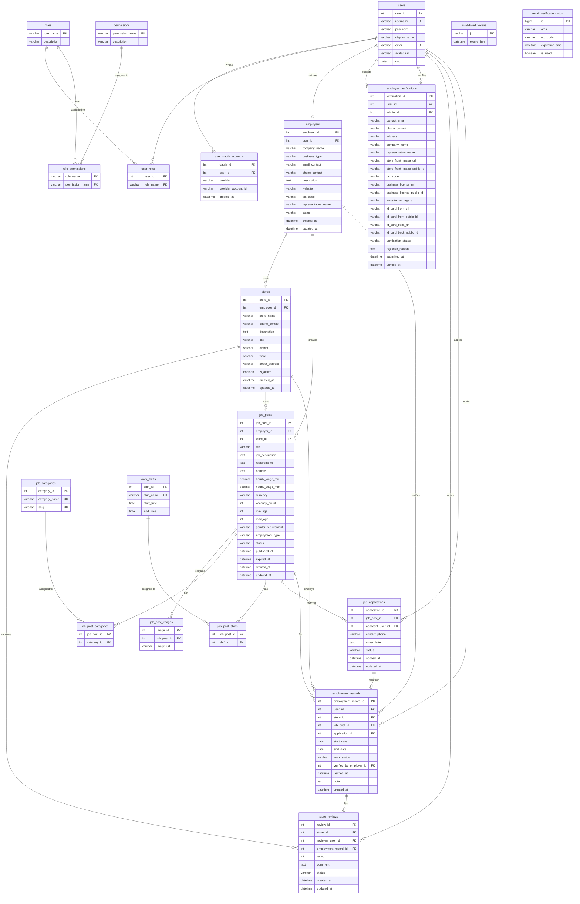

# Part-time Hiring Platform

A full-stack recruitment platform that connects job seekers with employers for part-time job opportunities. The system enables candidates to search and apply for jobs while allowing employers to manage stores, job postings, and applications through a centralized dashboard. 

*(Note: Some features listed below are currently under active development and will be completed in upcoming updates).*

---

## Features

### Authentication & Authorization
* JWT-based authentication
* Role-Based Access Control (RBAC)
* Google OAuth Login
* Spring Security integration

### Employer Management
* Employer registration and verification
* OTP email verification workflow
* Employer profile management
* Verification approval process

### Store Management
* Create and manage multiple stores
* Store information management
* Store media upload
* Store status tracking

### Job Management
* Create, update, and delete job posts
* Job categories and work shifts
* Job image management
* Job status management (Active, Closed, Expired)

### Application Management
* Apply for jobs
* Track application status
* Employer review and processing
* Hiring history management

### AI-Powered Moderation
* Validate job posts against employer profiles
* Detect fraudulent recruitment content
* Prevent unauthorized store creation
* Improve recruitment quality and trustworthiness

### Review System
* Store reviews and ratings
* Employment record verification
* Review moderation

---

## Technology Stack

### Backend
* Java 21
* Spring Boot
* Spring Security
* Spring Data JPA (Hibernate)
* JWT Authentication

### Frontend
* React 18
* TypeScript
* Vite

### Database
* MySQL

### Cloud Services
* Cloudinary

### DevOps
* Docker
* Git
* GitHub

### Authentication
* Google OAuth 2.0
* Email OTP Verification

---

## Database Design

**Main entities:**
* Users, Roles, Permissions
* Employers, Employer Verifications
* Stores
* Job Categories, Work Shifts, Job Posts
* Job Applications
* Employment Records
* Store Reviews

**Relationships:**
* One Employer → Many Stores
* One Store → Many Job Posts
* One Job Post → Many Applications
* One User → Many Applications

<details>
<summary><b>Click to view visual Database ER Diagram</b></summary>


</details>
* One Employment Record → One Review

---

## System Roles

### User
* Search jobs
* Apply for jobs
* Track applications
* Review workplaces

### Employer
* Verify business account
* Manage stores
* Create job posts
* Process applications

### Admin
* Manage users
* Approve employer verification
* Moderate job posts
* Monitor platform activities

---

## AI Moderation Workflow

1. Employer creates a store and job post.
2. AI analyzes:
   * Employer profile
   * Store information
   * Job title
   * Job description
3. If inconsistencies are detected:
   * Job post is flagged or rejected.
4. Valid job posts are published.

*Example:*
* **Verified Employer:** Highlands Coffee
* **Submitted Store:** Starbucks Coffee
* **Result:** AI flags the post as suspicious and prevents publication.

---

## Project Structure

```text
.
├── ParttimeHiringBackend    # Java Spring Boot API service
├── ParttimeHiringFrontend   # React Vite web application
├── database                 # Database schemas             
└── README.md                # Project overview (this file)
```

---

## Deployment

### Run with Docker

```bash
docker-compose up -d
```

### Run Spring Boot

```bash
cd ParttimeHiringBackend
./mvnw spring-boot:run
```

### Run Frontend Development Server

```bash
cd ParttimeHiringFrontend
npm install
npm run dev
```

---

## Future Improvements

* Resume/CV Upload
* AI Candidate Recommendation
* AI Job Matching
* Real-time Notifications
* Interview Scheduling
* Analytics Dashboard
* Mobile Application

---

## Author

**Ho Si Tan**  
Software Engineering Student  
FPT University Da Nang
